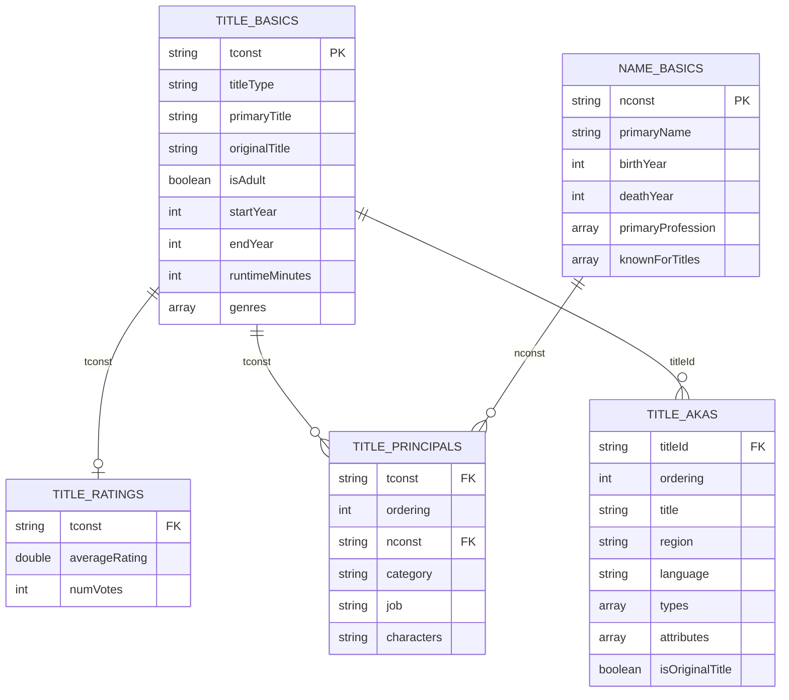
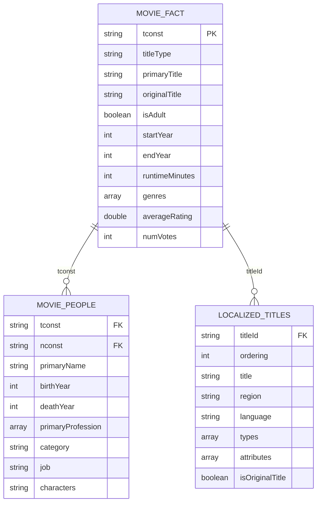

# IMDb Data Model

The IMDb dataset is normalized and consists of five source tables. The `title.basics` table is the central entity and is related to ratings, cast/crew information, and localized titles through the unique title identifier (`tconst`).

---

## Source Data Model (Bronze / Silver)



---

# Table Relationships

| Source Table | Target Table | Join Column | Cardinality | Description |
|---------------|--------------|-------------|-------------|-------------|
| `title.basics` | `title.ratings` | `tconst` | **1 : 0..1** | Every title may have zero or one aggregated IMDb rating record. |
| `title.basics` | `title.principals` | `tconst` | **1 : Many** | A movie or TV title can have multiple actors, directors, writers and crew members. |
| `title.principals` | `name.basics` | `nconst` | **Many : 1** | Multiple titles can reference the same person. |
| `title.basics` | `title.akas` | `tconst = titleId` | **1 : Many** | A title can have multiple localized names across countries and languages. |

---

# Gold Data Model

The normalized IMDb dataset is transformed into analytical tables optimized for OLAP workloads.



---

# Gold Tables

## 1. movie_fact

This is the primary analytical fact table.

It is created by joining:

- `title.basics`
- `title.ratings`

using:

```text
title.basics.tconst = title.ratings.tconst
```

The table contains one row per IMDb title and is optimized for analytical queries such as:

- Top rated movies
- Movies released per year
- Average runtime
- Average ratings by genre
- TV Series vs Movies
- Adult vs Non-adult titles

This is also the **largest dataset** in the pipeline.

---

## 2. movie_people

This table is created by joining

- `title.principals`
- `name.basics`

using

```text
title.principals.nconst = name.basics.nconst
```

This table supports analytics around:

- Actors
- Directors
- Writers
- Producers
- Crew Members

Typical analytical questions include:

- Which actor has appeared in the most movies?
- Which directors have the highest-rated movies?
- Distribution of professions.

---

## 3. localized_titles

This table is a cleaned version of `title.akas`.

No joins are performed.

It contains localized titles for every region and language.

Typical analytical questions include:

- Number of localized titles by country.
- Original title versus localized title.
- Language coverage of IMDb titles.

---

# Why is `localized_titles` kept as a separate table?

Although `title.akas` can technically be joined with `movie_fact`, doing so would duplicate every movie once for each localized title.

Example:

| Movie | Region | Localized Title |
|--------|--------|-----------------|
| Titanic | US | Titanic |
| Titanic | JP | タイタニック |
| Titanic | IN | டைட்டானிக் |
| Titanic | FR | Titanic |

Joining this table into `movie_fact` would produce four rows for the same movie.

As a consequence:

- Movie counts become incorrect.
- Average ratings become duplicated.
- Runtime aggregations become inaccurate.
- Storage requirements increase significantly.

Keeping localized titles in a separate table preserves the grain of the fact table:

> **One row in `movie_fact` represents one IMDb title.**

Localized titles can still be joined on demand whenever regional analysis is required.

---

# Partitioning Strategy

Only the **movie_fact** table is partitioned.

```text
movie_fact/

    titleType=movie/

        startYear=1995/

        startYear=1996/

    titleType=tvSeries/

    titleType=tvEpisode/
```

Partition Columns:

- `titleType`
- `startYear`

### Why these partitions?

The assignment recommends a partitioning strategy suitable for **category-based** or **time-series** analysis.

These two columns naturally satisfy those requirements.

Typical analytical queries include:

```sql
WHERE titleType = 'movie'
```

```sql
WHERE startYear BETWEEN 2015 AND 2025
```

Spark and DuckDB can perform **partition pruning**, reading only the relevant folders instead of scanning the complete dataset.

---

# Why are the other tables not partitioned?

## movie_people

Although it contains categories such as Actor, Director, Producer and Writer, most joins occur using:

```text
tconst
```

rather than

```text
category
```

Partitioning by category would create many partitions with relatively little performance benefit.

---

## localized_titles

Possible partition columns include:

- region
- language

However:

- the table is significantly smaller than `movie_fact`
- region and language contain many distinct values
- partitioning would generate numerous small directories and files

This increases metadata overhead while providing minimal query performance improvement.

Therefore, `localized_titles` is stored as a Snappy-compressed Parquet dataset without partitioning.

---

# Summary

| Gold Table | Source Tables | Join | Partitioned | Partition Columns |
|------------|---------------|------|--------------|-------------------|
| **movie_fact** | `title.basics` + `title.ratings` | `tconst` | ✅ Yes | `titleType`, `startYear` |
| **movie_people** | `title.principals` + `name.basics` | `nconst` | ❌ No | — |
| **localized_titles** | `title.akas` | None | ❌ No | — |