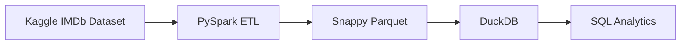
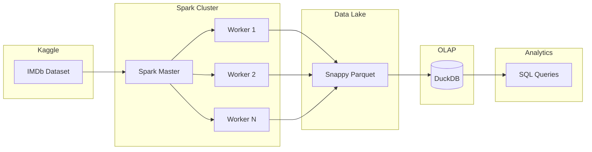
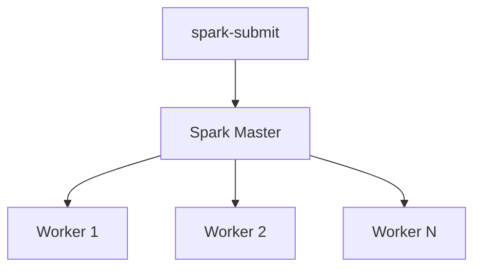
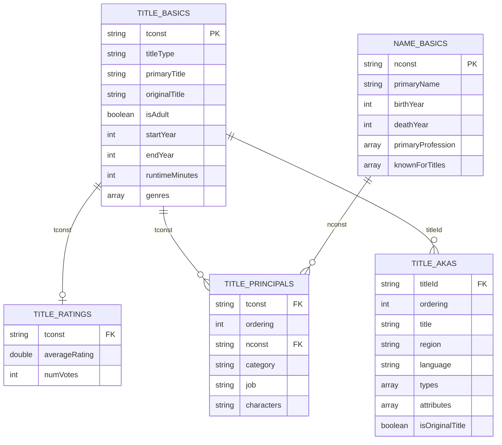
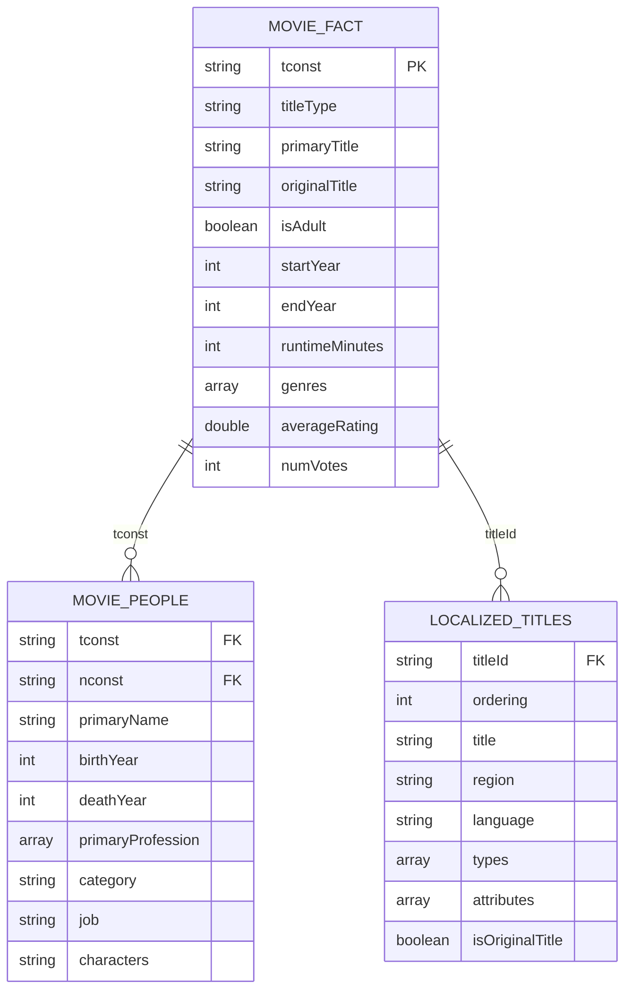

# tpy-imdb-olap-pipeline

## Overview

`tpy-imdb-olap-pipeline` is an end-to-end distributed data engineering project that ingests the public IMDb dataset from Kaggle, transforms the raw TSV files using Apache Spark, exports optimized Snappy-compressed Parquet datasets, and loads them into DuckDB to support high-performance OLAP (Online Analytical Processing) queries.

The project demonstrates a modern analytics pipeline combining distributed processing for ETL workloads with an embedded analytical database for interactive SQL queries.

The complete solution includes:

- Automated dataset download from Kaggle
- Distributed ETL using Apache Spark
- Dockerized Spark standalone cluster
- Python package distributed as a Wheel
- Snappy-compressed Parquet data lake
- DuckDB OLAP database
- SQL query scripts
- Reproducible Docker environment

---

# Project Objectives

The project fulfills the following objectives:

- Download the IMDb dataset from Kaggle.
- Clean and transform raw TSV datasets.
- Build reusable fact tables for analytical workloads.
- Export optimized Snappy-compressed Parquet datasets.
- Apply an appropriate partitioning strategy.
- Load Parquet datasets into DuckDB.
- Create indexes to improve analytical query performance.
- Execute SQL-based OLAP analysis.
- Package the ETL application as a reusable Python Wheel.
- Execute the pipeline on a distributed Spark cluster running in Docker.

---

# Features

## Data Ingestion

- Automatic Kaggle dataset download
- Environment-based authentication
- Re-runnable downloads
- Structured logging

## ETL Pipeline

- Explicit Spark schemas
- Null handling
- Data type conversions
- Array transformations
- Data cleansing
- Reusable DataFrame reader utility

## Distributed Processing

- Apache Spark Standalone Cluster
- Configurable number of Spark Workers
- Docker Compose deployment
- Distributed execution using `spark-submit`

## Data Lake

- Snappy-compressed Parquet
- Partitioned datasets
- Optimized analytical storage
- Columnar format

## OLAP Layer

- DuckDB database
- Automatic Parquet loading
- Index creation
- Interactive SQL querying

## Packaging

- Python Wheel
- Reusable package
- Docker-based execution
- Modular project structure

---

# Repository Structure

```text
tpy-imdb-olap-pipeline
│
├── .gitignore
├── docker-compose.yml
├── README.md
├── requirements.txt
├── setup.py
├── queriesOLAP.sql
├── queriesOLAPDDL.sql
├── PROMPTS.md
│
├── data
│   └── notebooks
│       └── analyzeData.ipynb
│
├── Docs
│   ├── datasetsDescriptions.md
│   ├── tables.md
│   └── SeniorDataEngineeringChallengePySpark.pdf
│
├── jobs
│   └── run_pipeline.py
│
├── spark
│   ├── Dockerfile
│   ├── entrypoint.sh
│   └── requirements.txt
│
└── tpyImdbPipeline
    │
    ├── __init__.py
    ├── main.py
    │
    ├── kaggleDownloader
    │   ├── kaggleDownloader.py
    │   └── __init__.py
    │
    └── utils
        ├── logger.py
        ├── schema.py
        ├── statusTracker.py
        └── __init__.py
```

---

# Dataset

Dataset Source

IMDb Dataset from Kaggle

https://www.kaggle.com/datasets/ashirwadsangwan/imdb-dataset/data

Dataset Identifier

```
ashirwadsangwan/imdb-dataset
```

The dataset consists of multiple normalized TSV files published by IMDb.

| Dataset | Description |
|----------|-------------|
| title.basics.tsv | Primary movie and TV title information |
| title.ratings.tsv | IMDb ratings and vote counts |
| title.principals.tsv | Principal cast and crew |
| title.akas.tsv | Localized titles for different languages and regions |
| name.basics.tsv | Person information |

The ETL pipeline transforms these normalized datasets into analytical fact tables suitable for OLAP workloads.

---

# Solution Architecture



---

# High-Level Architecture



---

# Spark Cluster Architecture

The project uses Apache Spark Standalone Mode deployed using Docker Compose.



The Spark cluster consists of:

- One Spark Master
- Configurable number of Spark Workers
- Shared mounted project directory
- Shared Parquet output
- Shared DuckDB database
- Shared log directory

Workers can be scaled dynamically using Docker Compose.

Example:

```bash
docker compose up -d --scale spark-worker=4
```

No changes to the application code are required when increasing or decreasing the number of workers.

---

# ETL Workflow

The ETL pipeline follows the classic Extract → Transform → Load pattern.


The pipeline performs the following operations:

### Extract

- Download IMDb dataset from Kaggle
- Read TSV files using explicit Spark schemas

### Transform

- Replace null markers
- Convert integer flags to Boolean
- Convert comma-separated values into arrays
- Preserve normalized relationships
- Join related datasets

### Load

- Export Snappy-compressed Parquet datasets
- Apply partitioning strategy
- Load Parquet datasets into DuckDB
- Create indexes
- Enable analytical SQL queries

---
# Data Model

The IMDb dataset is distributed across multiple normalized tables. During the ETL process these datasets are transformed into analytical fact tables while preserving the original relationships between movies, ratings, cast & crew, and localized titles.

The following sections describe both the source data model and the generated OLAP schema.

---

# Source Dataset Relationships



---

# Source Table Relationships

| Source Table | Target Table | Join Column | Cardinality | Description |
|--------------|-------------|-------------|-------------|-------------|
| title.basics | title.ratings | tconst | 1 : 0..1 | A title may have zero or one rating record. |
| title.basics | title.principals | tconst | 1 : Many | A title can have multiple cast and crew members. |
| title.principals | name.basics | nconst | Many : 1 | Multiple cast/crew records can reference the same person. |
| title.basics | title.akas | tconst = titleId | 1 : Many | A movie can have multiple localized titles across different countries and languages. |

---

# OLAP Data Model

The normalized IMDb dataset is transformed into three analytical tables.

The transformations reduce the number of joins required for common analytical workloads while keeping the localized titles independent.



---

# Generated OLAP Tables

## movie_fact

This table combines movie metadata with IMDb ratings into a single analytical fact table.

Source tables

- title.basics
- title.ratings

Contains

- Movie information
- Runtime
- Genres
- Adult flag
- Release year
- IMDb rating
- Vote count

This becomes the primary table for most analytical queries.

---

## movie_people

This table combines cast and crew information with person metadata.

Source tables

- title.principals
- name.basics

Contains

- Movie identifier
- Person identifier
- Actor/Director/Writer
- Character played
- Job title
- Person professions
- Birth year

Keeping this table separate avoids repeating person information for every movie inside the fact table.

---

## localized_titles

This table stores every alternate movie title published by IMDb.

Source table

- title.akas

Contains

- Region
- Language
- Localized title
- Alternative titles
- Original title indicator

A single movie can have dozens of localized titles. Embedding these into the movie fact table would duplicate movie information and significantly increase storage.

Keeping localized titles in a separate table maintains normalization while still allowing efficient joins when multilingual analysis is required.

---

# Parquet Partition Strategy

The ETL pipeline exports the analytical datasets as Snappy-compressed Parquet files.

Only the **movie_fact** dataset is partitioned.

```text
movie_facts/

├── titleType=movie
│   ├── startYear=1994
│   ├── startYear=1995
│   ├── startYear=1996
│   └── ...
│
├── titleType=tvSeries
│   ├── startYear=2019
│   ├── startYear=2020
│   └── ...
│
└── titleType=short
    └── ...
```

The partition columns are:

- titleType
- startYear

These columns were selected because they are frequently used in analytical queries such as:

```sql
WHERE titleType = 'movie'
```

```sql
WHERE startYear >= 2020
```

```sql
WHERE titleType='movie'
AND startYear BETWEEN 2015 AND 2025
```

Spark performs partition pruning, reading only the required partitions instead of scanning the complete dataset.

---

## Why movie_people is not partitioned

The movie_people dataset is primarily joined using:

- tconst
- nconst

Analytical queries typically retrieve people associated with a movie rather than filtering by a time dimension.

Partitioning by category or profession would create many small partitions with little benefit.

---

## Why localized_titles is not partitioned

Localized titles are relatively small compared to the movie dataset.

Most analytical queries access localized titles only after filtering movies.

The table is therefore stored as Snappy-compressed Parquet without partitioning.

DuckDB indexes provide efficient lookups when joined with the movie fact table.

---

# Loading into DuckDB

After the ETL process completes, the generated Parquet datasets are loaded into DuckDB.


The loading process performs the following operations:

1. Drop existing tables.
2. Create tables directly from Parquet files.
3. Create indexes.
4. Validate generated tables.

The following OLAP tables are created:

- movie_fact
- movie_people
- localized_titles

Indexes are then created on frequently accessed columns.

| Table | Indexed Columns |
|---------|----------------|
| movie_fact | tconst, primaryTitle, startYear |
| movie_people | tconst, nconst |
| localized_titles | titleId, region |

---

# Why DuckDB is Used for Analytical Queries

Apache Spark and DuckDB serve different purposes within the pipeline.

Spark is responsible for distributed data processing and transformation, while DuckDB is optimized for interactive analytical queries.

The workflow therefore uses the strengths of both technologies.

```text
Raw TSV

↓

PySpark ETL

↓

Partitioned Parquet

↓

DuckDB

↓

SQL Analytics
```

DuckDB provides several advantages for analytical workloads:

## Columnar Storage

DuckDB reads Parquet directly using a columnar execution engine.

Only the required columns are scanned instead of reading entire rows.

---

## Predicate Pushdown

Filters are pushed down into the Parquet reader, reducing the amount of data read from disk.

Example:

```sql
WHERE startYear >= 2020
```

Only matching row groups are scanned.

---

## Partition Pruning

The movie_fact dataset is partitioned by:

- titleType
- startYear

DuckDB reads only the required partitions, avoiding unnecessary file scans.

---

## Indexes

After loading the Parquet datasets, indexes are created on frequently queried columns.

Examples:

- tconst
- primaryTitle
- startYear
- region

These indexes improve lookup performance for joins and point queries.

---

## Reduced Cluster Overhead

Spark jobs require:

- Driver initialization
- Executor scheduling
- Task planning
- Distributed communication

These startup costs are appropriate for large-scale ETL but are unnecessary for interactive SQL queries.

DuckDB executes directly within a single embedded process, avoiding cluster coordination overhead.

---

## Optimized for Interactive SQL

DuckDB is designed for analytical workloads involving:

- Aggregations
- Sorting
- Filtering
- Grouping
- Joins
- Window functions

This makes it well suited for querying the processed IMDb data after the ETL phase has completed.

---

# Final OLAP Schema

```text
                    movie_fact
                 (Primary Fact Table)
                         │
              ┌──────────┴──────────┐
              │                     │
              │                     │
      movie_people         localized_titles
```

The final schema provides:

- A denormalized movie fact table for analytical queries.
- A reusable people dimension linked by movie identifier.
- A separate localized titles table for multilingual analysis.
- Partitioned Parquet storage for efficient scanning.
- DuckDB indexes for fast analytical SQL execution.

The resulting architecture separates distributed ETL processing from analytical query execution, allowing each technology to be used where it is most effective.

---

# Build Instructions

## Prerequisites

Install the following software before running the project.

- Python 3.8+
- Docker Desktop
- Docker Compose
- Git
- DuckDB CLI (optional, for querying the OLAP database)

---

## Clone the Repository

```bash
git clone <repository-url>
cd tpy-imdb-olap-pipeline
```

---

## Create a Python Virtual Environment

### Windows

```cmd
python -m venv .venv
.venv\Scripts\activate
```

### Linux / macOS

```bash
python3 -m venv .venv
source .venv/bin/activate
```

Upgrade pip.

```bash
python -m pip install --upgrade pip
```

Install development dependencies.

```bash
pip install -r requirements.txt
```

---

## Configure Environment Variables

Create a `.env` file in the project root.

```properties
# Logging

LOG_PATH="/opt/project/logs/"
LOG_FILE_NAME="tpyImdbPipeline.log"

# Kaggle

KAGGLE_USERNAME="your_username"
KAGGLE_API_TOKEN="your_api_token"

KAGGLE_DOWNLOAD_DIR="/opt/project/data/raw/"
KAGGLE_DATASET="ashirwadsangwan/imdb-dataset"

# Parquet Output

TARGET_PARQUET_PATH="/opt/project/data/processed/"

# DuckDB

DUCKDB_DATABASE_PATH="/opt/project/database/duckdb/imdb.duckdb"

# Spark

SPARK_WORKER_MEMORY=2G
SPARK_WORKER_CORES=2
```

---

# Building the Python Wheel

The ETL application is packaged as a reusable Python Wheel.

Generate the wheel using:

```bash
python -m build
```

The generated artifact will be available under:

```text
dist/

└── tpyImdbPipeline-<version>-py3-none-any.whl
```

The Spark cluster executes the ETL pipeline directly from this wheel.

---

# Docker Setup

Build the Spark image.

```bash
docker compose build --no-cache
```

Verify the generated image.

```bash
docker images
```

Start the Spark cluster.

Example with four workers:

```bash
docker compose up -d --scale spark-worker=4
```

Verify running containers.

```bash
docker ps
```

Open the Spark Master UI.

```
http://localhost:8080
```

The Spark cluster consists of:

- One Spark Master
- Configurable Spark Workers
- Shared project directory
- Shared Parquet output
- Shared DuckDB database
- Shared logs

---

# Verifying the Spark Environment

Open a shell inside the Spark Master.

```bash
docker exec -it spark-master bash
```

Verify the active user.

```bash
whoami
```

Verify Python.

```bash
python --version
```

Verify installed packages.

```bash
pip freeze
```

Verify Spark.

```bash
spark-submit --version
```

Verify PySpark.

```python
import pyspark

print(pyspark.__version__)
```

---

# Updating the Python Wheel

Whenever the application code changes:

1. Rebuild the wheel locally.

```bash
python -m build
```

2. Reinstall the latest wheel inside the Spark Master.

```bash
docker exec spark-master \
pip install --force-reinstall \
/opt/project/dist/tpyImdbPipeline-*.whl
```

Since the `dist` directory is mounted as a Docker volume, rebuilding the Docker image is **not required** when only Python code changes.

---

# Running the Spark ETL Pipeline

Submit the ETL pipeline to the Spark cluster.

### Linux / macOS

```bash
docker exec spark-master spark-submit \
    --master spark://spark-master:7077 \
    --py-files /opt/project/dist/tpyImdbPipeline-1.0.0-py3-none-any.whl \
    /opt/project/jobs/run_pipeline.py
```

### Windows CMD

```cmd
docker exec spark-master spark-submit --master spark://spark-master:7077 --py-files /opt/project/dist/tpyImdbPipeline-1.0.0-py3-none-any.whl /opt/project/jobs/run_pipeline.py
```

---

# Pipeline Execution

The submitted Spark job performs the following steps.


Generated artifacts:

```text
data/

├── raw/

├── processed/
│   ├── movie_facts/
│   ├── movie_people/
│   └── title_akas/

database/

└── duckdb/
    └── imdb.duckdb

logs/

└── tpyImdbPipeline.log
```

---

# DuckDB CLI Installation

## Windows

Install DuckDB using WinGet.

```cmd
winget install DuckDB.cli
```

If the executable is not available on the command line, add the installation directory to the Windows PATH.

Example:

```
C:\Users\<username>\AppData\Local\Microsoft\WinGet\Packages\DuckDB.cli_Microsoft.Winget.Source_8wekyb3d8bbwe
```

Open a new terminal.

Verify installation.

```cmd
duckdb --version
```

---

## Linux

```bash
curl https://install.duckdb.org | sh
```

---

## macOS

```bash
brew install duckdb
```

---

# Opening the Generated Database

Open DuckDB.

```bash
duckdb database/duckdb/imdb.duckdb
```

Display tables.

```sql
SHOW TABLES;
```

Display table schema.

```sql
DESCRIBE movie_fact;
```

---

# Example Analytical Queries

The repository includes two SQL files.

| File | Purpose |
|------|----------|
| queriesOLAP.sql | Example analytical SQL queries |
| queriesOLAPDDL.sql | DuckDB DDL used by the ETL pipeline |

Example query:

```sql
SELECT
    primaryTitle,
    averageRating,
    numVotes
FROM movie_fact
ORDER BY averageRating DESC
LIMIT 10;
```

Count movies by release year.

```sql
SELECT
    startYear,
    COUNT(*) AS total_movies
FROM movie_fact
GROUP BY startYear
ORDER BY startYear;
```

Top actors by number of movies.

```sql
SELECT
    primaryName,
    COUNT(*) AS total_movies
FROM movie_people
GROUP BY primaryName
ORDER BY total_movies DESC
LIMIT 20;
```

Localized titles.

```sql
SELECT
    title,
    region,
    language
FROM localized_titles
WHERE titleId='tt0111161';
```

---

# Stopping the Cluster

Stop all running containers.

```bash
docker compose down
```

Remove containers, anonymous volumes and networks.

```bash
docker compose down -v
```

Remove the Spark image.

```bash
docker rmi custom-spark
```

---

# Future Improvements

Possible enhancements include:

- Apache Iceberg support
- Delta Lake integration
- Apache Airflow workflow orchestration
- Incremental ETL processing
- Change Data Capture (CDC)
- Data quality validation framework
- MinIO object storage
- Kubernetes deployment
- CI/CD using GitHub Actions
- Query performance monitoring
- Automated unit and integration testing
- Metadata catalog integration
- Data lineage tracking
- Grafana monitoring dashboards

---

# Technologies Used

| Category | Technology |
|-----------|------------|
| Language | Python |
| Distributed Processing | Apache Spark |
| Cluster Manager | Spark Standalone |
| Containerization | Docker |
| Orchestration | Docker Compose |
| Storage Format | Parquet |
| Compression | Snappy |
| OLAP Engine | DuckDB |
| Dataset | IMDb Kaggle Dataset |
| Packaging | Python Wheel |
| Query Language | SQL |

---

# License

This project was developed as part of the Senior Data Engineering Technical Challenge and is intended for educational and evaluation purposes.
